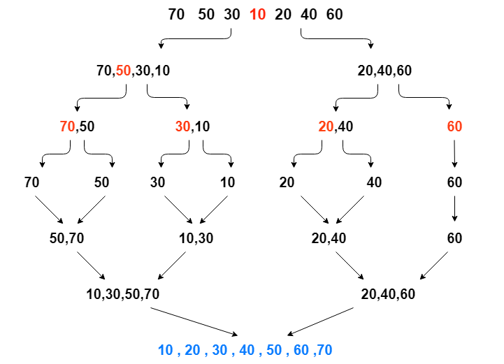
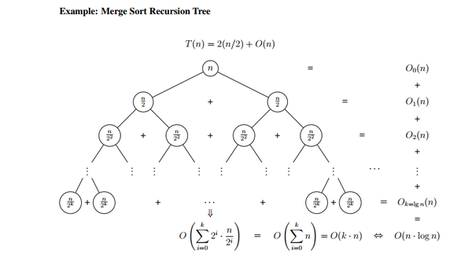

# Алгоритмы и их оценка

## 1. Введение: зачем оценивать эффективность алгоритмов

В современной информатике алгоритмы лежат в основе практически всех программных систем — от мобильных приложений до крупных распределённых вычислительных платформ. Однако разработка алгоритма не заканчивается тем, что он корректно решает поставленную задачу. Не менее важно понимать, **насколько эффективно он выполняется**.

Под эффективностью алгоритма обычно понимают два основных аспекта:

* время выполнения;
* объём используемой памяти.

Именно эти ресурсы в вычислительных системах чаще всего оказываются ограниченными.

На первый взгляд может показаться, что проблема эффективности в значительной степени утратила актуальность. Вычислительные системы становятся более производительными, объём доступной оперативной памяти увеличивается, а облачные технологии позволяют масштабировать ресурсы по мере необходимости. В связи с этим разработчики нередко уделяют недостаточно внимания эффективности алгоритмов, особенно на ранних этапах создания программных систем.

Тем не менее последствия такого подхода проявляются достаточно быстро. Программные системы постепенно увеличиваются в объёме, требуют всё большего количества памяти, а время их запуска и выполнения возрастает. Пользователь сталкивается с задержками отклика интерфейса, повышенным энергопотреблением устройств и снижением общей производительности системы. В крупных программных комплексах это приводит к увеличению требований к инфраструктуре и, как следствие, к росту эксплуатационных затрат.

Существует и организационный фактор. В условиях жёстких сроков разработки приоритет часто отдаётся скорости реализации функциональности, а не оптимальности алгоритмических решений. В результате в программных системах накапливаются неэффективные решения, которые впоследствии существенно усложняют масштабирование и сопровождение.

Даже периодическое внимание к эффективности алгоритмов позволяет значительно повысить качество программных систем. Рациональный выбор алгоритма способен уменьшить время выполнения вычислений на порядки без изменения аппаратных ресурсов.

Для того чтобы сравнивать алгоритмы между собой и обоснованно выбирать наиболее подходящий метод решения задачи, необходимы формальные способы оценки эффективности.

## 2. Понятие алгоритма

Прежде чем обсуждать методы оценки эффективности, необходимо уточнить, что именно понимается под алгоритмом. Это важно, поскольку анализу подлежит не программа как таковая и не конкретная реализация на определённом языке, а **абстрактный способ решения задачи**.

В интуитивном смысле алгоритм — **это точно заданная последовательность действий, выполнение которой приводит к решению некоторой задачи для допустимых входных данных.**

Такое понимание отражает сущность алгоритма, однако не обладает достаточной строгостью: не всякое описание процесса можно считать алгоритмом. В теории алгоритмов и учебной традиции выделяют ряд характеристик, наличие которых позволяет отнести описанный способ решения к алгоритмам. Эти характеристики задают требования к построению алгоритма и одновременно обеспечивают возможность его формального анализа.

#### Конечность (завершаемость)

Алгоритм должен завершаться за конечное число шагов для любых допустимых входных данных. Это означает, что процесс вычисления не может продолжаться бесконечно: по завершении должен быть получен результат либо выполнено корректное завершение в пределах постановки задачи.

Отсутствие гарантий завершения делает метод решения непригодным для практического применения: в таком случае не существует оснований ожидать получения ответа за конечное время.

Примером завершающегося алгоритма служит последовательный поиск в конечном массиве: просмотр элементов либо приводит к обнаружению искомого значения, либо заканчивается после проверки всех элементов. В противоположность этому, описания вида «повторять действия до наступления некоторого условия», не содержащие аргумента, гарантирующего наступление условия, допускают бесконечное выполнение.

#### Определённость (однозначность шагов)

Каждый шаг алгоритма должен быть сформулирован так, чтобы исключить неоднозначную интерпретацию. Для заданного состояния вычисления следующая операция должна определяться однозначно.

Если инструкции допускают различные трактовки, результат может зависеть от исполнителя или от контекста выполнения, а значит, описанный процесс перестаёт быть воспроизводимым.

Например, правило «если текущий элемент больше следующего, поменять их местами» является однозначным. Формулировки вроде «если порядок неудобен, исправить его» не задают точного критерия и потому не обладают алгоритмической определённостью.

#### Массовость

Алгоритм предназначен для решения не единичного примера, а целого класса однотипных задач. Иначе говоря, алгоритм задаёт общий метод, применимый к различным входным данным, а не последовательность действий для заранее фиксированного набора значений.

Так, алгоритм сортировки применим к любому массиву элементов заданного типа и длины. Напротив, «сравнить 7 и 12 и вывести меньшее» описывает решение одного конкретного случая и не является общим методом сравнения двух произвольных чисел.

#### Результативность (наличие результата)

Выполнение алгоритма должно приводить к результату, соответствующему поставленной задаче. Результат может быть числом, логическим значением, преобразованным набором данных, построенной структурой или иным объектом, определённым в условии задачи.

Если процесс завершается, но не производит результата (или производит результат, не связанный с задачей), то задача не считается решённой.

#### Дополнение: распространённые уточняющие характеристики

В ряде источников дополнительно упоминаются дискретность (пошаговость) и элементарность шагов. Эти характеристики уточняют изложенные выше требования: пошаговость согласуется с представлением вычисления как последовательности операций, а элементарность — с необходимостью формулировать шаги в терминах допустимых базовых действий.

Алгоритмы могут иметь различную природу и степень сложности. Рассмотрим несколько типичных примеров.

* **Поиск элемента в массиве**
  Последовательный просмотр элементов до обнаружения искомого значения или завершения списка.

* **Сортировка набора данных**
  Упорядочивание элементов по возрастанию или убыванию согласно заданному критерию.

* **Вычисление наибольшего общего делителя (алгоритм Евклида)**
  Последовательное применение операции деления с остатком до получения нулевого остатка.

* **Выполнение арифметических вычислений по фиксированным правилам**
  Например, вычисление значения многочлена по заданным коэффициентам.

Важно отметить, что один и тот же класс задач часто допускает несколько различных алгоритмов решения. Именно поэтому возникает необходимость сравнивать алгоритмы между собой по эффективности.

Тут следует различать:

* **алгоритм** — абстрактное описание способа решения задачи;
* **программу** — конкретную реализацию алгоритма на некотором языке программирования.

Различные реализации одного и того же алгоритма могут отличаться по стилю, используемым структурам данных или техническим деталям, но при этом сохранять одинаковую логическую структуру вычислений.

При анализе эффективности нас будет интересовать прежде всего алгоритм как математическая модель вычислительного процесса, а не особенности его программной реализации.

Стоит отметить, что в теоретической информатике существуют строгие математические модели, позволяющие формально описывать вычисления. К числу таких моделей относятся, например, машина Тьюринга, λ-исчисление, нормальные алгоритмы Маркова и другие. Они позволяют точно определить, какие процессы являются вычислимыми, и составляют основу теории алгоритмов и вычислимости.

Однако задачи данного курса связаны не столько с вопросом возможности вычисления, сколько с вопросом затрат ресурсов, необходимых для выполнения вычислений. Поэтому для последующего анализа достаточно практического представления об алгоритме как о точно заданной последовательности элементарных действий над данными.

Важным обстоятельством является то, что одну и ту же задачу нередко можно решить несколькими различными алгоритмами. При этом корректность решения сама по себе ещё не определяет предпочтительность алгоритма: различные методы могут существенно отличаться по требуемым вычислительным ресурсам.

По этой причине возникает задача сравнения алгоритмов между собой. Такое сравнение проводится по затратам ресурсов, прежде всего по времени выполнения и объёму используемой памяти.

Для проведения подобного сравнения необходимо прежде всего определить, каким образом измеряется время выполнения алгоритма.

## 3. Оценка времени выполнения алгоритма

Сравнение алгоритмов по эффективности предполагает количественную оценку ресурсов, необходимых для их выполнения. Наиболее существенным ресурсом в большинстве вычислительных задач является время выполнения.

На первый взгляд естественным способом оценки может показаться непосредственное измерение времени работы программы в секундах или других физических единицах. Однако такой подход не позволяет корректно сравнивать алгоритмы как абстрактные методы решения задач. Измеренное время зависит не только от структуры алгоритма, но и от множества внешних факторов: характеристик вычислительного оборудования, особенностей архитектуры системы, используемого языка программирования, реализации компилятора и текущей загрузки вычислительной среды. В результате полученная величина отражает совокупность условий выполнения, а не собственные свойства алгоритма.

Поэтому для теоретического анализа требуется способ оценки времени выполнения, не зависящий от конкретной вычислительной системы. С этой целью вводится абстрактная вычислительная модель, в рамках которой выполнение алгоритма рассматривается как последовательность элементарных операций, каждая из которых считается выполняемой за одинаковое постоянное время. Такое допущение позволяет отвлечься от технических особенностей реализации и сосредоточиться на структуре вычислений.

Под элементарными операциями понимаются простейшие действия, время выполнения которых не зависит от объёма входных данных. К ним обычно относят арифметические операции над числами фиксированной разрядности, сравнение значений, присваивание переменных, обращение к элементу массива по индексу и базовые логические операции. Конкретный перечень элементарных операций может различаться в зависимости от выбранной формальной модели вычислений, однако разумные модели оказываются эквивалентными с точки зрения оценки роста времени выполнения алгоритмов.

Чтобы описать зависимость времени выполнения от объёма обрабатываемой информации, необходимо количественно характеризовать входные данные. Для этого вводится параметр $n$, называемый размером входных данных. Его конкретный смысл определяется характером задачи: при обработке массива он равен числу элементов, при работе с графами — числу вершин или рёбер, в строковых алгоритмах — длине строки, а в числовых вычислениях — размеру представления числа. В каждом случае выбирается та характеристика данных, изменение которой существенно влияет на объём выполняемых вычислений.

Пусть алгоритм применяется к входным данным размера $ n $. В рамках выбранной модели вычислений можно определить количество элементарных операций, выполняемых алгоритмом. Функция $ T(n) $,равная числу элементарных операций, выполняемых алгоритмом на входных данных размера $ n $, называется функцией времени выполнения алгоритма. Таким образом, анализ времени выполнения алгоритма сводится к исследованию зависимости $T(n)$ от параметра $n$.

Во многих случаях можно получить выражение для функции $T(n)$, описывающее число элементарных операций, выполняемых алгоритмом. Однако такое выражение неизбежно зависит от принятой вычислительной модели и от того, какие действия считаются элементарными. Поэтому даже при детальном анализе речь обычно идёт не о времени выполнения в абсолютном смысле, а о его описании в рамках выбранных допущений. При сравнении алгоритмов такая степень детализации, как правило, не требуется. Различные реализации одного и того же алгоритма могут приводить к различным выражениям для числа операций, хотя принципиальное поведение алгоритма при увеличении размера входа остаётся одинаковым. Кроме того, получаемые выражения обычно содержат постоянные множители и добавочные слагаемые, влияние которых уменьшается по мере роста $ n $. Наконец, детальный подсчёт операций нередко приводит к громоздким формулам, затрудняющим сравнение алгоритмов и не дающим дополнительного понимания их поведения.

Поэтому при анализе эффективности основное внимание уделяется не точному значению функции времени выполнения, а характеру её роста при увеличении размера входных данных. Если два алгоритма решают одну и ту же задачу, их функции времени выполнения могут различаться для конкретных значений $n$, однако при увеличении размера входа становится существенным, насколько быстро возрастает каждая из этих функций. Алгоритм, для которого функция времени выполнения растёт медленнее, при достаточно больших значениях $n$ будет требовать меньшего числа вычислительных операций.

Таким образом, задача сравнения алгоритмов сводится к сравнению функций времени выполнения по скорости их роста. Для формального описания роста функций используется специальный математический аппарат — асимптотические оценки. Они позволяют классифицировать алгоритмы по порядку роста их функций времени выполнения и тем самым формализуют понятие временной сложности алгоритма.

Построение функции времени выполнения продемонстрируем на примере конкретного алгоритма сортировки.

Пусть требуется упорядочить массив из $n$ элементов по возрастанию следующим способом. На первом шаге среди всех элементов массива находится минимальный и меняется местами с первым элементом. На втором шаге минимальный элемент ищется среди оставшихся $n-1$ элементов и помещается на вторую позицию. Процесс продолжается до тех пор, пока не будут обработаны все позиции массива. Такой метод сортировки известен как сортировка выбором.

```
for i = 0...(n-1):
    imin = i
    for j = i...(n-1):
        if (a[j] < a[imin]):
            imin = j
    swap(a[i], a[imin])

```

Оценим число операций сравнения, выполняемых этим алгоритмом. Чтобы определить минимальный элемент среди $n$ значений, необходимо выполнить $n$ сравнений. После размещения первого элемента остаётся $n-1$ неупорядоченных элементов, и для поиска следующего минимального требуется уже $n-1$ сравнений. Далее выполняется $n-2$ сравнений и так далее, пока не останется один элемент, не требующий проверки (но мы его все равно проверим и потратим 1 элементарную операцию).

Таким образом, общее число сравнений равно
```math
n + (n-1) + (n-2) + \dots + 1.
```
Эта сумма представляет собой сумму первых $n$ натуральных чисел и равна$\frac{n(n+1)}{2}.$
Кроме сравнений, алгоритм выполняет операции обмена элементов. Всего таких операций будет $n$. Кроме того, сама операция обмена может быть реализована различным числом присваиваний.

Если учитывать только сравнения и обмены как элементарные операции, то функцию времени выполнения можно записать, например, в виде
```math
T(n) = \frac{n(n+1)}{2} + cn,
```
где $c$ — число элементарных действий, необходимых для выполнения одного обмена.

Однако это выражение не является единственно возможным. Оно зависит от того, какие действия считаются элементарными, учитываются ли дополнительные присваивания, проверяются ли условия перед обменом, а также от способа реализации самого алгоритма. При ином выборе элементарных операций или иной реализации выражение для $T(n)$ изменится, хотя общий характер роста функции останется тем же.

Этот пример показывает, что функция времени выполнения описывает число операций лишь в рамках принятой модели вычислений и выбранного способа подсчёта. Поэтому она отражает структуру алгоритма лишь приближённо и служит прежде всего для анализа зависимости объёма вычислений от размера входных данных.


## 4. Асимптотический анализ алгоритмов

Функция времени выполнения алгоритма $T(n)$, введённая ранее, описывает число элементарных операций как функцию размера входных данных $n$. Однако, как мы уже говорили, при сравнении алгоритмов обычно не требуется точное выражение этой функции, поскольку оно зависит от выбранной модели вычислений и деталей реализации. Существенным является не точное значение функции времени, а характер её роста при увеличении размера входных данных.

Для формального сравнения функций по скорости роста используются  асимптотические оценки. Они позволяют описывать поведение функций при достаточно больших значениях аргумента, абстрагируясь от несущественных деталей.

Пусть $f(n)$ и $g(n)$ — функции, определённые на натуральных числах и принимающие неотрицательные значения при достаточно больших $n$. Говорят, что функция $f(n)$ асимптотически не превосходит функцию $g(n)$, если начиная с некоторого момента $f(n)$ ограничена сверху некоторым постоянным кратным функции $g(n)$.

**Определение (Big O).**  
Говорят, что
```math
f(n) = O(g(n)),
```
если существуют такие константы $c > 0$ и $n_0 \in \mathbb{N}$, что для всех $n \ge n_0$ выполняется неравенство
```math
0 \le f(n) \le c\, g(n).
```

В этом случае функция $g(n)$ задаёт асимптотическую верхнюю границу роста функции $f(n)$.

**Пример.**  
Функция $5n + 3$ принадлежит $O(n)$.  
Действительно, при $n \ge 3$ выполняется
```math
5n + 3 \le 6n,
```
поэтому можно выбрать $c = 6$ и $n_0 = 3$.

**Пример.**  
Функция $3n^2 + 10n + 7$ принадлежит $O(n^2)$.  
Для $n \ge 1$ выполняется
```math
3n^2 + 10n + 7 \le 3n^2 + 10n^2 + 7n^2 = 20n^2,
```
поэтому можно взять $c = 20$ и $n_0 = 1$.

Из примеров можно видеть, что асимптотическая верхняя граница не является точным описанием функции, а задаёт лишь ограничение на скорость её роста при достаточно больших значениях аргумента. Именно такие оценки используются для описания временной сложности алгоритмов.

Кроме того, асимптотическая верхняя граница не обязана быть наименьшей возможной. Функция может принадлежать множеству различных верхних оценок.

**Пример.**  

Рассмотрим, например, функцию $f(n) = n^2$.  
Для всех $n \ge 1$ выполняется неравенство
```math
n^2 \le n^3.
```
Следовательно, можно выбрать $c = 1$ и $n_0 = 1$. Поэтому
```math
n^2 = O(n^3).
```

Тем не менее, хотя функция может иметь множество асимптотических верхних границ, в практическом анализе алгоритмов используют наиболее точные из них — верхние оценки наименьшего порядка роста.

Также наряду с асимптотической верхней границей используется и асимптотическая нижняя граница.

**Определение (Omega).**  
Говорят, что
```math
f(n) = \Omega(g(n)),
```
если существуют такие константы $c > 0$ и $n_0 \in \mathbb{N}$, что для всех $n \ge n_0$ выполняется неравенство
```math
0 \le c\, g(n) \le f(n).
```

В этом случае функция $g(n)$ задаёт асимптотическую нижнюю границу роста функции $f(n)$.

**Пример.**  
Функция $3n^2 + 10n + 7$ принадлежит $\Omega(n^2)$.

Для всех $n \ge 1$ выполняется
```math
3n^2 + 10n + 7 \ge 3n^2.
```
Следовательно, можно выбрать $c = 3$ и $n_0 = 1$.

**Пример.**  
Функция $n \log n + 100n + 7$ принадлежит $\Omega(n \log n)$.

При $n \ge 2$ выполняется $\log n \ge 1$, поэтому
```math
n \log n + 100n + 7 \ge n \log n.
```
Следовательно, можно выбрать $c = 1$ и $n_0 = 2$.

Как и в случае асимптотических верхних границ, нижняя граница не обязана быть наибольшей возможной. Функция может иметь множество различных нижних оценок.

**Пример.**  
Функция $n \log n$ принадлежит $\Omega(n)$.

При $n \ge 2$ выполняется $\log n \ge 1$, поэтому
```math
n \log n \ge n.
```
Следовательно, можно выбрать $c = 1$ и $n_0 = 2$.

Хотя более точной нижней оценкой для этой функции является $\Omega(n^3)$, указанное соотношение также корректно.

Введённые ранее асимптотические верхние и нижние границы описывают рост функции только с одной стороны — сверху или снизу. Однако во многих случаях удаётся установить одновременно и верхнюю, и нижнюю границы одного и того же порядка. Это означает, что функция растёт с той же скоростью, что и некоторая эталонная функция, с точностью до постоянных множителей.

Такая ситуация формализуется понятием асимптотически точной оценки.

**Определение (Theta).**  
Говорят, что
```math
f(n) = \Theta(g(n)),
```
если существуют такие положительные константы $c_1, c_2$ и $n_0 \in \mathbb{N}$, что для всех $n \ge n_0$ выполняется
```math
0 \le c_1 g(n) \le f(n) \le c_2 g(n).
```

В этом случае функция $g(n)$ задаёт асимптотически точную оценку роста функции $f(n)$.

Иными словами, $f(n)$ и $g(n)$ имеют одинаковый порядок роста.


**Пример.**  
Функция $3n^2 + 10n + 7$ принадлежит $\Theta(n^2)$.

Ранее было показано, что
```math
3n^2 + 10n + 7 = O(n^2).
```
Кроме того, для всех $n \ge 1$```math
3n^2 + 10n + 7 \ge 3n^2,
```
поэтому
```math
3n^2 + 10n + 7 = \Omega(n^2).
```
Следовательно,
```math
3n^2 + 10n + 7 = \Theta(n^2).
```

**Пример.**  
Функция $n \log n + 100n + 7$ принадлежит $\Theta(n \log n)$.

Для достаточно больших $n$ выполняются оценки
```math
n \log n \le n \log n + 100n + 7 \le C\, n \log n
```
при некоторой константе $C$. Следовательно, функция одновременно ограничена сверху и снизу величиной порядка $n \log n$, и потому имеет тот же порядок роста.

Связь между асимптотическими обозначениями $O$, $\Omega$ и $\Theta$ выражается следующим утверждением.

**Теорема.**  
Для любых функций $f(n)$ и $g(n)$, принимающих неотрицательные значения при достаточно больших $n$,
```math
f(n) = \Theta(g(n)) \quad \Longleftrightarrow \quad f(n) = O(g(n)) \ \text{и}\ f(n) = \Omega(g(n)).
```

**Доказательство.**

(**⇒**)  
Пусть $f(n) = \Theta(g(n))$. Тогда существуют $c_1, c_2 > 0$ и $n_0$, такие что
```math
c_1 g(n) \le f(n) \le c_2 g(n)
\quad \text{при } n \ge n_0.
```
Правая часть неравенства даёт $f(n) = O(g(n))$, левая — $f(n) = \Omega(g(n))$.

(**⇐**)  
Пусть $f(n) = O(g(n))$ и $f(n) = \Omega(g(n))$. Тогда существуют константы $c_1, c_2 > 0$ и числа $n_1, n_2$, такие что
```math
f(n) \le c_2 g(n) \quad (n \ge n_1),
```
```math
c_1 g(n) \le f(n) \quad (n \ge n_2).
```
Положим $n_0 = \max(n_1, n_2)$. Тогда для всех $n \ge n_0$```math
c_1 g(n) \le f(n) \le c_2 g(n),
```
что по определению означает $f(n) = \Theta(g(n))$.

∎

Из определения асимптотически точной оценки следуют фундаментальные свойства, широко используемые при анализе алгоритмов.

**Теорема (инвариантность относительно постоянного множителя).**  
Если $c > 0$ — постоянная, то
```math
\Theta(c\,f(n)) = \Theta(f(n)).
```

**Доказательство.**  
Умножение функции на положительную константу изменяет её значения лишь в постоянное число раз, что не влияет на выполнение двойного неравенства из определения $\Theta$.
∎

**Теорема (доминирование старшего порядка при сложении).**  
Пусть функции $f(n)$ и $g(n)$ неотрицательны при достаточно больших $n$, и пусть
```math
f(n) = o(g(n)),
```
то есть
```math
\lim_{n\to\infty} \frac{f(n)}{g(n)} = 0.
```
Тогда
```math
f(n) + g(n) = \Theta(g(n)).
```

**Доказательство.**  
Из условия следует, что начиная с некоторого момента $f(n) \le g(n)$. Тогда
```math
g(n) \le f(n)+g(n) \le 2g(n)
```
при достаточно больших $n$, что по определению означает $\Theta(g(n))$.
∎

Асимптотические оценки позволяют не только анализировать отдельные алгоритмы, но и сравнивать скорость роста различных функций. Такое сравнение лежит в основе классификации алгоритмов по их эффективности.

При достаточно больших значениях аргумента функции разных типов растут с принципиально различной скоростью. Некоторые растут крайне медленно, другие — чрезвычайно быстро. Это позволяет упорядочить наиболее распространённые типы функций по возрастанию скорости роста.

Типичные порядки роста, встречающиеся при анализе алгоритмов, можно расположить следующим образом:

| Порядок роста | Пример функции | Комментарий |
|---|---|---|
| $1$ | $5$, $100$ | постоянное время |
| $\log n$ | $\log_2 n$ | логарифмический рост |
| $n$ | $3n$ | линейный рост |
| $n \log n$ | $2n \log n$ | характерен для эффективных сортировок |
| $n^2$ | $n^2 + n$ | квадратичный рост |
| $n^3$ | $5n^3$ | кубический рост |
| $2^n$ | $2^n$ | экспоненциальный рост |
| $n!$ | факториал | сверхэкспоненциальный рост |

Для понимания относительной скорости роста полезно отметить несколько фундаментальных соотношений между распространёнными типами функций.

Логарифмические функции растут медленнее любых степенных функций. Это означает, что отношение логарифма к любой положительной степени аргумента стремится к нулю при неограниченном увеличении аргумента.

Любая степенная функция растёт медленнее любой экспоненциальной функции с основанием больше единицы. Иначе говоря, отношение степени аргумента к экспоненте стремится к нулю при увеличении аргумента.

Экспоненциальные функции, в свою очередь, растут медленнее факториала.

Эти соотношения позволяют сравнивать алгоритмы по скорости роста их функций времени без детального анализа точных выражений.

В качестве примера ранее была рассмотрена сортировка выбором. Для неё было получено выражение функции времени выполнения
```math
T(n) = n(n+1)/2 + c n.
```

Это точная (в рамках выбранной модели вычислений) формула числа элементарных операций. Однако для классификации алгоритма по скорости роста интерес представляет не сама формула, а её асимптотическое поведение при увеличении n.

Заметим, что
```math
n(n+1)/2 = (1/2)n^2 + (1/2)n,
```
поэтому
```math
T(n) = (1/2)n^2 + (1/2 + c)n.
```

При достаточно больших значениях n эта функция ограничена сверху и снизу величинами, пропорциональными $n^2$. Следовательно,$T(n) = Θ(n^2)$.

Таким образом, сортировка выбором имеет квадратичную временную сложность.

Рассмотрим более содержательный пример, в котором функция времени выполнения естественным образом представляет собой сумму нескольких слагаемых различного порядка роста.

Пусть дан список из $n$ слов (например, текст документа), и требуется вывести $K$ наиболее часто встречающихся слов.

Алгоритм может быть организован следующим образом.

1. Последовательно просматривать слова и подсчитывать число вхождений каждого слова, используя ассоциативный контейнер `map`, в котором каждому слову сопоставляется счётчик его появлений.
2. Преобразовать полученное отображение в список пар вида (слово, частота).
3. Отсортировать этот список по убыванию частоты.
4. Вывести первые $K$ элементов отсортированного списка.

Запишем этот алгоритм в виде псевдокода.
```
freq = map()
for word in w:
    freq[w]++
pairs = list of all (word, count) from freq
sort pairs by count descending
output first K elements
```

Оценим время выполнения.

Пусть $k$ — число различных слов во входных данных (очевидно, $k \le n$).

Подсчёт частот требует $n$ операций обращения к контейнеру `map`. Согласно справочным данным, каждая операция поиска или вставки в `map` выполняется за $O(\log k)$ времени. Следовательно, этап подсчёта частот требует
```math
O(n \log k).
```

Преобразование отображения в список пар требует одного прохода по всем различным словам, то есть $O(k)$.

Сортировка списка из $k$ элементов требует (опять же согласно справочным данным)
```math
O(k \log k).
```

Вывод первых $K$ элементов требует $O(K)$, что не превосходит $O(k)$.

Таким образом, функция времени выполнения алгоритма имеет вид
```math
T(n) = O(n \log k) + O(k) + O(k \log k).
```

Поскольку $k \le n$, можно сравнить скорости роста входящих слагаемых. При увеличении $n$ логарифмически умноженные члены растут быстрее линейных, а среди них доминирует член наибольшего порядка.

Если число различных слов пропорционально размеру входа (что часто имеет место на практике), то есть $k = \Theta(n)$, получаем
```math
T(n) = \Theta(n \log n).
```

Этот пример демонстрирует общий принцип: если функция времени выполнения представима в виде суммы нескольких слагаемых различного порядка роста, то её асимптотически точная оценка определяется слагаемым, растущим быстрее остальных. Именно этот факт и формализуется теоремой о доминирующем члене.

## 5. Оценка рекурсивных алгоритмов

Среди алгоритмов широко распространён подход, при котором исходная задача сводится к нескольким задачам того же типа, но меньшего размера. Такое описание естественным образом приводит к рекурсии: алгоритм формулируется через себя же, применённого к уменьшенным входным данным. Подобные схемы встречаются в сортировках, поиске, обработке деревьев и графов, вычислении выражений и во многих других задачах.

Для анализа времени выполнения рекурсивных алгоритмов прямой подсчёт элементарных операций часто оказывается неудобен. Число вызовов и их размеры зависят от структуры рекурсии, поэтому удобнее описывать время работы с помощью *рекуррентного соотношения*: функции, выражающей время решения задачи размера $n$ через время решения задач меньшего размера и стоимость дополнительной работы, выполняемой «на текущем уровне» (то есть вне рекурсивных вызовов). Далее полученное рекуррентное соотношение анализируется как математический объект.

В качестве основного примера будет рассмотрена сортировка слиянием (Merge Sort).

Пусть дан массив из $n$ элементов. Сортировка слиянием устроена следующим образом.

Сначала массив делится на две части, как правило, максимально близкие по размеру. Затем каждая из этих частей сортируется тем же способом: снова делится на две части, и так далее. Процесс разбиения продолжается до тех пор, пока не будут получены подмассивы длины 1. Подмассив из одного элемента считается отсортированным.

После этого начинается обратная фаза — объединение. На каждом шаге берутся два отсортированных подмассива и объединяются в один отсортированный массив. Такое объединение выполняется процедурой слияния.

Слияние двух отсортированных массивов устроено просто. Сравниваются первые (ещё не использованные) элементы обоих массивов. Меньший из них переносится в результирующий массив, после чего указатель в соответствующем массиве сдвигается на один элемент. Затем сравнение повторяется. Как только один из массивов исчерпан, оставшаяся часть другого массива целиком дописывается в конец результата.

Пошаговое разбиение массива на части и последующее слияние удобно иллюстрируются рисунком, на котором показано, как из подмассивов длины 1 последовательно формируются более длинные отсортированные блоки, пока не будет получен полностью отсортированный массив.




```
merge(a, b):
    i = 0, j = 0
    res = []
    while i < a.size and j < b.size:
        if (a[i] <= b[j]):
            res.push(a[i])
            i += 1
        else 
            res.push(b[j])
            j += 1
    while i < a.size:
        res.push(a[i]); i += 1
    while j < b.size:
        res.push(b[j]); j += 1
    return res

mergesort(v):
    if v.size == 1:
        return v
    a, b = split(v, v.size // 2)
    a = mergesort(a)
    b = mergesort(b)
    return merge(a, b)
```

В приведенном коде для простоты будем считать, что все массивы передаются по ссылке, а также все операции копирования массивов выполняются за $O(1)$.

Пусть $T(n)$ обозначает время выполнения сортировки слиянием для массива, содержащего $n$ элементов. Иными словами, $n$ — это число элементов, которые требуется отсортировать.

Рассмотрим, какие действия выполняет алгоритм при обработке массива длины $n$.

Сначала массив разбивается на две части примерно одинаковой длины. Каждая из этих частей затем сортируется тем же алгоритмом. Таким образом, задача сортировки массива из $n$ элементов сводится к решению двух задач того же типа, но для массивов длины примерно $n/2$.

После того как обе половины отсортированы, они объединяются в один отсортированный массив. Эта операция называется слиянием.

При слиянии два уже отсортированных массива объединяются в один. На каждом шаге сравниваются текущие элементы этих массивов, и меньший из них добавляется в результирующий массив. Затем сравнение повторяется для оставшихся элементов.

Каждый элемент переносится в результирующий массив только один раз. Для переноса каждого элемента требуется примерно одно и то же количество простых действий (сравнение, запись и т.п.). Поэтому общее время слияния пропорционально числу объединяемых элементов.

Поскольку всего объединяется $n$ элементов, время слияния можно оценить как некоторое постоянное число действий на каждый элемент, умноженное на $n$. Обозначим это постоянное число через $c$. Тогда время слияния можно записать как $cn$.

Итак, обработка массива длины $n$ включает:

- сортировку двух подмассивов длины примерно $n/2$;
- их последующее слияние, время которого пропорционально $n$.

Тем самым время работы алгоритма выражается через время работы на массивах меньшего размера. Это приводит к рекуррентному соотношению
```math
T(n)=2T\!\left(\frac{n}{2}\right)+cn.
```

Когда размер массива равен единице, сортировка не требует дальнейших действий, поскольку массив из одного элемента уже упорядочен. Поэтому время работы в этом случае является некоторой постоянной величиной.

Полученное рекуррентное соотношение удобно анализировать, рассматривая дерево рекурсивных вызовов (см. рисунок).



В верхней части дерева рекурсии находится исходный вызов алгоритма, который сортирует массив длины $n$. Этот вызов разбивает массив на две части примерно по $n/2$ элементов и запускает сортировку для каждой из них.

Каждый из этих вызовов, в свою очередь, снова делит свой массив пополам. Поэтому на следующем уровне появляются вызовы, сортирующие массивы длины примерно $n/4$. Этот процесс продолжается до тех пор, пока алгоритм не начнёт работать с массивами длины 1.

После того как массивы на некотором уровне уже отсортированы, каждая пара соседних отсортированных частей объединяется в один массив. Такое объединение выполняется на каждом уровне разбиения. Время, затрачиваемое на объединение, пропорционально числу элементов, которые объединяются на данном уровне.

Рассмотрим, какой объём работы выполняется на каждом уровне разбиения.

На самом верхнем уровне объединяются две половины исходного массива. Их общая длина равна $n$, поэтому суммарная работа на этом уровне пропорциональна $n$.

На следующем уровне объединяются уже две пары массивов меньшей длины. Каждая пара содержит примерно по $n/2$ элементов, и таких объединений выполняется два. В сумме снова объединяется $n$ элементов.

Ещё ниже объединяются четыре пары массивов длины примерно $n/4$. Таких объединений больше, но каждая пара короче. В сумме вновь объединяется $n$ элементов.

И так происходит на каждом уровне: количество объединений увеличивается, длина объединяемых частей уменьшается, но суммарное число элементов, участвующих в объединении на уровне, остаётся равным $n$.

Следовательно, на каждом уровне выполняется работа одного и того же порядка — пропорциональная $n$.

Остаётся оценить число уровней. На каждом шаге размер подзадачи уменьшается вдвое. Число таких уменьшений до достижения размера 1 равно $\log_2 n$. Таким образом, число уровней равно $\Theta(\log n)$.

Итак, суммарное время выполнения равно сумме вкладов всех уровней:
```math
T(n) = \Theta(n)\cdot \Theta(\log n) = \Theta(n\log n).
```

Анализ уровней рекурсивных вызовов приводит к оценке порядка $n \log n$. Проверим, что она получена корректно. Для этого докажем её методом математической индукции.

Сначала установим верхнюю оценку. Покажем, что решение рекуррентного соотношения
```math
T(n)=2T\!\left(\frac{n}{2}\right)+cn
```
растёт не быстрее, чем $n\log n$.

Будем рассматривать значения $n$, равные степеням двойки. Это упрощает запись и не влияет на порядок роста функции.

Пусть для некоторой константы $C>0$ выполняется неравенство
```math
T(m)\le C m\log m
```
для всех степеней двойки $m<n$. Проверим, что тогда оно выполняется и для $n$.

Из рекуррентного соотношения имеем
```math
T(n)=2T(n/2)+cn.
```
Подставляя предположение для $n/2$, получаем
```math
T(n)\le 2C\frac{n}{2}\log\frac{n}{2}+cn.
```
Преобразуем выражение:
```math
T(n)\le Cn(\log n-1)+cn
= Cn\log n - Cn + cn.
```

Если выбрать константу $C$ не меньшей, чем $c$, то выражение $-Cn+cn$ не превосходит нуля. Тогда
```math
T(n)\le C n\log n.
```

Тем самым показано, что при подходящем выборе константы $C$ неравенство выполняется для всех степеней двойки $n$. Следовательно,
```math
T(n)=O(n\log n).
```

Остаётся показать, что полученная оценка по порядку роста не завышена, то есть что время работы алгоритма не может расти существенно медленнее, чем $n\log n$.

Для этого достаточно заметить, что на каждом уровне рекурсивного разбиения выполняется операция слияния, и суммарно на уровне объединяется ровно $n$ элементов. Ранее уже было установлено, что слияние двух отсортированных частей требует по крайней мере некоторого постоянного числа элементарных действий на каждый переносимый элемент. Обозначим это постоянное число через $c_1>0$. Тогда суммарная работа по слиянию на любом уровне не меньше $c_1 n$.

Число уровней разбиения равно $\log_2 n$, поскольку на каждом шаге длина обрабатываемых частей уменьшается вдвое, пока не достигнет 1. Следовательно, суммарное время работы алгоритма удовлетворяет оценке снизу
```math
T(n)\ge c_1 n \log_2 n,
```
то есть
```math
T(n)=\Omega(n\log n).
```

Таким образом, сортировка слиянием имеет временную сложность $\Theta(n\log n)$.

В общем случае когда мы решаем рекуррентное соотношение, мы обычно сначала предполагаем, как быстро растёт время работы алгоритма. Например, предполагаем, что оно растёт не быстрее, чем $n\log n$.

Чтобы убедиться, что это действительно так, используется математическая индукция. Её идея очень простая.

Сначала мы предполагаем, что нужная оценка уже верна для всех меньших размеров входных данных. То есть считаем, что если алгоритм работает с меньшим числом элементов, то его время уже можно оценить так, как мы предполагаем.

Затем подставляем это предположение в рекуррентную формулу. Рекуррентная формула выражает время работы на размере $n$ через время работы на меньших размерах. После подстановки всё выражение можно упростить и сравнить с той оценкой, которую мы хотим доказать.

Обычно после упрощения остаются дополнительные слагаемые. Тогда выбирают константу в оценке достаточно большой (или иногда достаточно маленькой), чтобы неравенство всё равно выполнялось.

Если после такой подстановки и упрощения оказывается, что оценка верна и для текущего значения $n$, значит она верна для всех размеров. Именно это и делает математическая индукция.

В рассмотренном примере рекуррентное соотношение удалось проанализировать напрямую: сначала была получена оценка с помощью дерева рекурсивных вызовов, затем она была подтверждена математической индукцией. Однако выполнять такие рассуждения отдельно для каждого алгоритма может быть довольно трудоёмко.

Во многих задачах возникают рекуррентные соотношения похожего вида: время работы выражается через несколько рекурсивных вызовов меньшего размера и дополнительную работу на текущем уровне. Для таких типичных ситуаций существует общий результат, позволяющий сразу определить порядок роста функции времени без развёртывания рекурсии и без отдельного доказательства по индукции.

Этот результат называется мастер-теоремой.

## 6. Мастер-теорема

**Теорема (мастер-теорема).**  
Пусть функция $T(n)$ задана рекуррентным соотношением
```math
T(n)=a\,T\!\left(\frac{n}{b}\right)+f(n),
```
где $a\ge 1$, $b>1$, а функция $f(n)$ неотрицательна при достаточно больших $n$. Обозначим
```math
\alpha=\log_b a.
```

Тогда порядок роста $T(n)$ определяется сравнением функции $f(n)$ с функцией $n^\alpha$.

1. Если существует $\varepsilon>0$ такое, что
```math
f(n)=O\!\left(n^{\alpha-\varepsilon}\right),
```
то
```math
T(n)=\Theta\!\left(n^\alpha\right).
```

2. Если существует $k\ge 0$ такое, что
```math
f(n)=\Theta\!\left(n^\alpha \log^k n\right),
```
то
```math
T(n)=\Theta\!\left(n^\alpha \log^{k+1} n\right).
```

3. Если существует $\varepsilon>0$ такое, что
```math
f(n)=\Omega\!\left(n^{\alpha+\varepsilon}\right),
```
и дополнительно выполнено условие регулярности: существует число $q<1$, такое что при достаточно больших $n$
```math
a\,f\!\left(\frac{n}{b}\right)\le q\,f(n),
```
то
```math
T(n)=\Theta\!\left(f(n)\right).
```

**Доказательство.**

Рассмотрим дерево рекурсивных вызовов для соотношения
```math
T(n)=aT(n/b)+f(n).
```
Для удобства будем считать, что $n=b^h$ для некоторого целого $h$; это не влияет на порядок роста.

На верхнем уровне выполняется работа $f(n)$.  
На следующем уровне возникает $a$ подзадач размера $n/b$, поэтому суммарная работа равна
```math
a\,f(n/b).
```
На уровне $i$ возникает $a^i$ подзадач размера $n/b^i$, и суммарная работа равна
```math
W_i=a^i\,f\!\left(\frac{n}{b^i}\right).
```

Глубина дерева равна $\log_b n$. Число листьев равно
```math
a^{\log_b n}=n^{\log_b a}=n^\alpha.
```
Если стоимость базового случая постоянна, суммарный вклад листьев равен $\Theta(n^\alpha)$.

Полное время работы есть сумма вкладов всех уровней:
```math
T(n)=\sum_{i=0}^{\log_b n-1} a^i f\!\left(\frac{n}{b^i}\right)+\Theta(n^\alpha).
```

Дальнейшее поведение суммы определяется сравнением величин $W_i$.

Если $f(n)$ растёт существенно медленнее, чем $n^\alpha$, то вклады верхних уровней малы, а суммарный вклад листьев порядка $n^\alpha$ становится определяющим. Отсюда $T(n)=\Theta(n^\alpha)$.

Если $f(n)$ имеет тот же порядок, что и $n^\alpha$ (возможно, с логарифмическим множителем), то вклад каждого уровня имеет один и тот же порядок. Поскольку уровней порядка $\log n$, появляется дополнительный множитель $\log n$, что даёт $T(n)=\Theta(n^\alpha \log^{k+1} n)$.

Если же $f(n)$ растёт быстрее, чем $n^\alpha$, и выполнено условие регулярности, то вклады уровней убывают по геометрической прогрессии при переходе вниз по дереву. Поэтому суммарная работа определяется верхними уровнями и имеет тот же порядок, что и $f(n)$. Следовательно, $T(n)=\Theta(f(n))$.

Теорема доказана.

## 7. Оценка использования памяти алгоритмом

Помимо времени выполнения важной характеристикой алгоритма является объём памяти, необходимый для его работы. Даже если алгоритм выполняется достаточно быстро, чрезмерное потребление памяти может сделать его непрактичным: программа может занимать слишком много оперативной памяти, медленно запускаться или вообще не выполняться при ограниченных ресурсах.

При анализе памяти, как и при анализе времени, нас интересует не точное число используемых байтов, а зависимость объёма памяти от размера входных данных. Если вход имеет размер $n$, то рассматривают функцию $M(n)$, описывающую объём памяти, который требуется алгоритму.

Важно различать два вида памяти.

Во-первых, память, необходимая для хранения входных данных. Обычно она не учитывается при анализе, поскольку вход уже задан и его объём определяется самой задачей.

Во-вторых, дополнительная память, которую алгоритм использует в процессе работы: временные массивы, вспомогательные структуры данных, стек рекурсивных вызовов и т.п. Именно этот объём обычно оценивается при анализе алгоритма.

Если объём дополнительной памяти ограничен постоянной величиной, не зависящей от размера входа, говорят, что алгоритм использует **константную дополнительную память**. Такие алгоритмы называют выполняющимися *на месте* (in-place). Простейший пример — поиск максимального элемента массива: требуется лишь несколько переменных независимо от длины массива.

Если же алгоритм создаёт вспомогательные структуры, размер которых зависит от $n$, то память растёт вместе с размером входа. Например, если создаётся дополнительный массив длины $n$, то объём памяти имеет порядок $O(n)$.

Рассмотрим примеры.

При сортировке слиянием, помимо рекурсивных вызовов, на этапе объединения используется дополнительный массив, в который временно записываются элементы. Его размер пропорционален числу сортируемых элементов. Следовательно, дополнительная память, требуемая для хранения временного массива, имеет порядок $O(n)$.

Кроме того, сортировка слиянием является рекурсивной, поэтому используется стек рекурсивных вызовов. Глубина рекурсии равна числу раз, которое массив можно делить пополам, то есть порядка $\log n$. Это означает, что память стека имеет порядок $O(\log n)$.

В сумме дополнительная память алгоритма определяется наибольшим из этих вкладов. Поскольку линейная зависимость растёт быстрее логарифмической, общая оценка дополнительной памяти для сортировки слиянием равна
```math
O(n).
```

В других алгоритмах ситуация может быть иной.

Например, если алгоритм последовательно просматривает данные и использует ассоциативный контейнер (например, отображение значений в счётчики), то объём памяти определяется числом различных элементов, которые необходимо хранить. Если их количество пропорционально размеру входа, память также имеет порядок $O(n)$.

С другой стороны, некоторые алгоритмы сортировки (например, сортировка выбором или сортировка вставками) не создают дополнительных массивов и используют лишь небольшое фиксированное число переменных. Их дополнительная память имеет порядок $O(1)$.

Таким образом, оценка памяти выполняется по тем же принципам, что и оценка времени:

- определяется, какие данные алгоритм создаёт или хранит дополнительно;
- оценивается объём этих данных как функция размера входа;
- выделяется доминирующий по росту вклад.

Как и в случае времени выполнения, нас интересует порядок роста памяти при увеличении размера входных данных. Именно эта зависимость позволяет сравнивать алгоритмы и выбирать более эффективные с точки зрения использования ресурсов.

## 8. Выводы

Эффективность алгоритма определяется затратами ресурсов, прежде всего **времени выполнения** и **используемой памяти**. При анализе нас интересуют не точные значения, а **зависимость этих затрат от размера входных данных**.

Время работы алгоритма описывается функцией $T(n)$. Для сравнения алгоритмов исследуют **скорость роста** этой функции при увеличении $n$. Такой анализ выполняется с помощью **асимптотических оценок**:
- $O(\cdot)$ — верхняя граница роста,
- $\Omega(\cdot)$ — нижняя граница,
- $\Theta(\cdot)$ — точный порядок роста.

При работе с асимптотикой игнорируются константные множители и слагаемые меньшего порядка: поведение функции определяется **доминирующим членом**.

Для рекурсивных алгоритмов время работы описывается **рекуррентными соотношениями**. Их анализ выполняется с помощью:
- дерева рекурсивных вызовов,
- математической индукции,
- мастер-теоремы для типичных соотношений вида $T(n)=aT(n/b)+f(n)$.

Помимо времени оценивается **дополнительная память**, используемая алгоритмом. Анализ проводится аналогично анализу времени: определяется зависимость объёма памяти от размера входа и выделяется доминирующий вклад.

Главная цель анализа эффективности — понять, **как алгоритм масштабируется** при увеличении объёма данных и сравнить различные алгоритмы между собой по использованию вычислительных ресурсов.

# Задачи

### 1. Альтернативные определения
(a) Покажите, что определение $O$ останется равносильным исходному, если поменять $\le$ на $<$.

(b) Покажите, что определение $\Omega$ останется равносильным исходному, если поменять $\ge$ на $>$.


### 2. Поиск точной асимптотики
Для каждой из следующих функций $f(n)$ найдите наиболее компактно записываемую $g(n)$, такую что  
```math
f(n)=\Theta(g(n)),
```
и докажите это.

(a) $f(n)=\log(\sqrt{n})+\sqrt{\log n}$
(b) $f(n)=n\cdot 3^{n+1}+n^{10}$
(c) $f(n)=\dfrac{10n^2+2}{7n-1}$
(d) $f(n)=\log(2n\log n)$

### 3. Сравнение функций роста
Верно ли, что
```math
n=o\!\big((\log n)^{\log n}\big)\ ?
```
Докажите или опровергните.

### 4. Несравнимые функции
Приведите пример двух положительных функций $f$ и $g$, для которых не выполняется ни  $f=O(g)$, ни $g=O(f)$.

Уточнение: не привязывайтесь к тому, что обычно рассматривается как время работы алгоритма. Подойдут любые положительные функции.

### 5. Нижняя оценка гармонического ряда
Докажите, что
```math
\sum_{t=1}^{n}\frac{1}{t}=\Omega(\log n).
```
Пользоваться тем, что гармонический ряд приближается логарифмом, без доказательства нельзя.

### 6. Доказательства по определению
Докажите следующие утверждения по определению.

(a) Для любых $f$ и $g$ верно, что  
```math
f(n)+g(n)=O(\max(f(n),g(n))).
```

(b) Если $f_1(n)=O(f_2(n))$ и $g_1(n)=O(g_2(n))$, то  
```math
f_1+g_1=O(f_2+g_2).
```

(c) Если $f(n)$ — полином степени $d$, то  
```math
f(n)=\Theta(n^d).
```

### 7. Нестандартные преобразования
Для каждого утверждения докажите его или приведите контрпример.  
Если утверждение неверно, но становится верным при дополнительном условии — укажите это условие.

(a) Для $g(n)=f(n)^2$ верно $f(n)=O(g(n))$
(b) Для любой $f$ верно $f(n)=\Omega\!\big(f(n/2)\big)$
(c) Если $f(n)=O(g(n))$, то $e^{f}=O(e^{g})$
(d) Если $f(n)>1$ для всех $n$ и $f(n)=o(g(n))$, то $e^{f}=o(e^{g})$
(e) Если $f(n)=O(g(n))$, то $\log_2(f)=O(\log_2(g))$
(f) Если $f(n)=o(g(n))$, то $\log_2(f)=o(\log_2(g))$

### 8. Асимптотика рекуррент (дерево рекурсии)
Найдите $\Theta$-асимптотику времени работы, построив дерево рекурсивных вызовов.

(a) $T(n)=T(n-1)+2n^2$
(b) $T(n)=3T(n/2)+2$
(c) $T(n)=T(n/3)+\log_2 n$
### 9. Доказательства по индукции (рекурренты)
Докажите следующие утверждения по индукции.  
Во всех пунктах считать $T(1)=1$.

(a) Если $T(n)=2T(\sqrt{n})+1$, то $T(n)=O(\log n)$
(b) Если $T(n)=\log(n)\cdot T\!\left(\dfrac{n}{\log n}\right)+n$, то $T(n)=O(n\log n)$
(c) Если $T(n)=2T\!\left(\dfrac{n}{2}+\log n\right)+n$, то $T(n)=O(n\log n)$
### 10. Сравнение алгоритмов
Есть алгоритм $A$, работающий за $T_A(n)$, и алгоритм $B$, работающий за $T_B(n)$. Известно:

```math
T_A(n)=7T_A(n/2)+n^2
```
```math
T_B(n)=x\,T_B(n/4)+n
```

При каких значениях $x$ второй алгоритм асимптотически медленнее первого?


### 11. Точная асимптотика рекуррент
Найдите точную $\Theta$-асимптотическую оценку.

(a) $T(n)=2T(n/2)+\sqrt{n}$
(b) $T(n)=3T(\sqrt{n})+\log n$
(c) $T(n)=2T(n/2)+\dfrac{n}{\log n}$